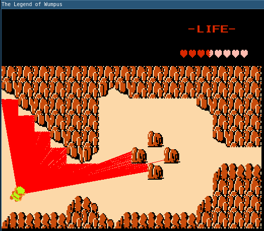
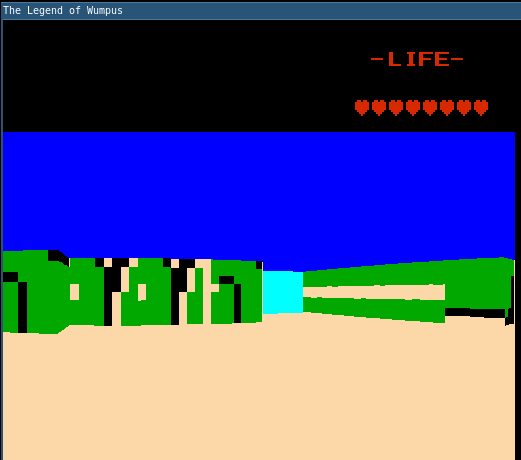
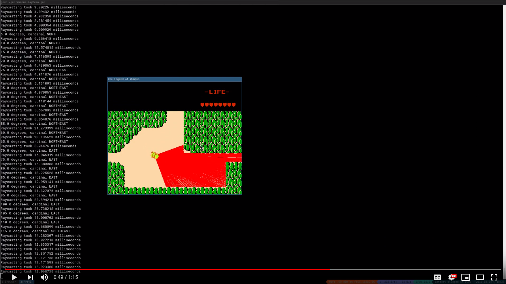

# The Legend of Wumpus 3D
Wumpus 3D is a small addition to a previous game, the [Legend of Wumpus](https://github.com/DylanJones/legend-of-wumpus).  Wumpus 3D was inspired by Wolfenstien 3D.\

Wumpus 3D works by casting rays out from the player in a 90 degree cone, as shown here:\

The code then uses the intersections to draw the textures on the screen in proportion to how far away the ray hit.

